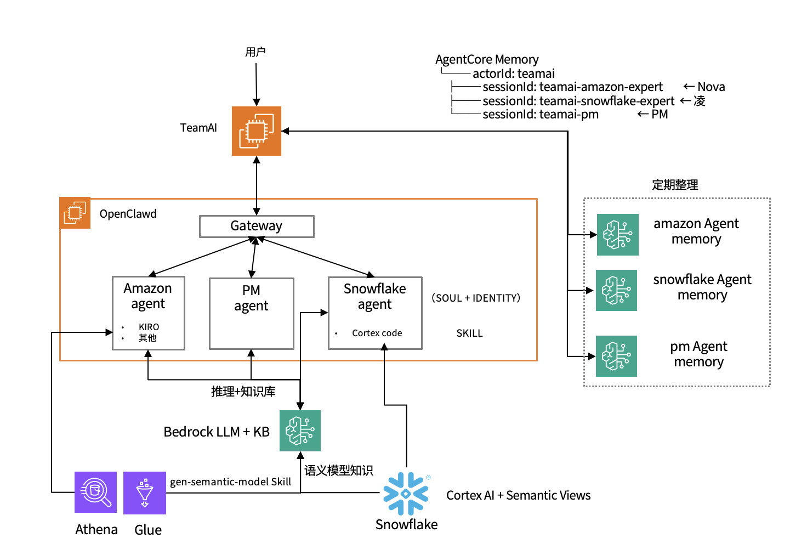
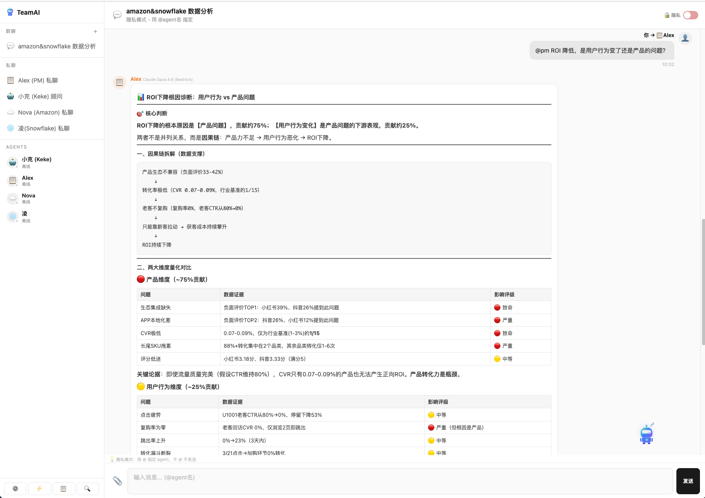
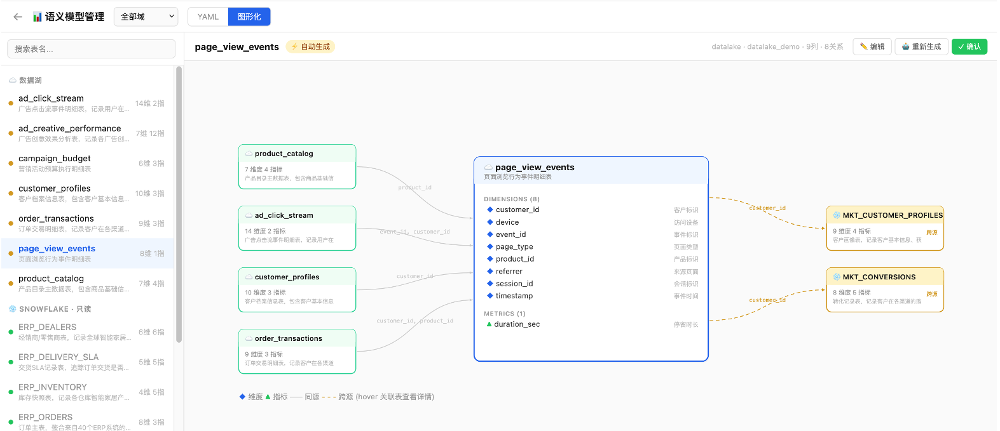
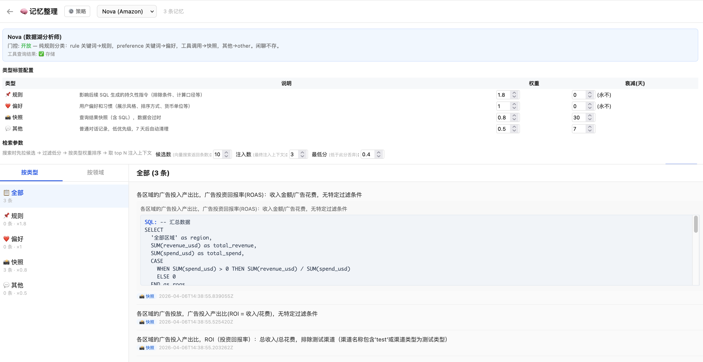

# TeamAI — 多专家 Data Agent 协同平台 需求说明

## 项目概述

基于 OpenClaw Gateway 构建的多 Agent 协同数据分析平台。多个领域专家 Agent（数据湖、数据仓库）在同一个对话界面中协作，通过 PM 编排完成跨领域的企业数据分析任务。系统通过 Neptune Analytics 语义图理解数据结构，通过 Adaptive Memory 积累业务经验，通过 Human-in-the-Loop 确认机制确保查询准确性。

## 技术栈

- **Agent 运行时**：OpenClaw Gateway（开源，部署在 Amazon EC2）
- **前端/中间件**：TeamAI（Node.js + Express + WebSocket）
- **模型推理**：Amazon Bedrock（Claude Sonnet 4.5）
- **长期记忆**：Amazon OpenSearch Serverless（向量索引 + kNN 搜索，Bedrock Titan Embed v2）
- **知识库**：Amazon Bedrock Knowledge Base + S3 + OpenSearch Serverless
- **数据湖**：Amazon S3 + Athena + Glue Catalog
- **语义图**：Amazon Neptune Analytics（向量搜索 + 图遍历，存储数据湖表关系和语义）
- **数据仓库**：Snowflake + Cortex AI + Semantic Views

## Agent 团队

| Agent | ID | 角色 | 负责领域 | 核心 Skill |
|-------|-----|------|----------|-----------|
| Alex | pm | 项目经理 | 任务拆解、分发、汇总 | 无（纯编排） |
| Nova | amazon-expert | Amazon 数据专家 | 用户行为分析（数据湖） | aws-cli, datalake_query, gen-semantic-model |
| 凌 | snowflake-expert | Snowflake 数据专家 | 营销效果、产品口碑、供应链 | snowflake-cortex-code |

## 核心功能需求

### F1: 多 Agent 对话界面

- 支持群聊和私聊两种模式
- 群聊支持隐私模式（Agent 只看到 @自己的消息）和开放模式
- 支持 @mention 指定 Agent 回答
- 支持消息转发（将一个 Agent 的回复转给另一个 Agent 评价）
- Markdown 渲染、代码高亮、消息搜索
- 移动端响应式布局

### F2: PM 编排机制

- PM Agent 收到跨领域问题时，自动拆解为多个子任务
- 以 JSON 指令格式输出任务分配：`{action: "delegate", tasks: [{agent, task}], summary_instruction}`
- 系统解析 JSON 指令，将子任务并行分发给对应专家 Agent
- 每个专家在独立的会话通道中执行
- 支持 Agent 间重定向（专家认为问题不在自己领域时建议转给其他专家）
- 所有子任务完成后，系统将结果打包发给 PM 汇总
- PM 生成最终报告返回给用户
- 前端任务看板实时展示子任务状态和耗时
- 支持中途取消任务

### F3: 语义层

#### F3.1: Snowflake 侧 — Semantic Views 同步到Neptune语义图
- 定时任务（每天）从 Snowflake 读取所有 Semantic Views 的 JSON 定义
- 解析表、维度、指标、关系，写入 Neptune Analytics 图（source=snowflake）
- 先清后写模式：每次同步前删除 source=snowflake 的旧节点，再重新写入
- 与数据湖侧共用同一个 Neptune 图实例，PM 查图可看到全部数据源

#### F3.2: 数据湖侧 — Neptune Analytics 语义图
- 定时任务（每天）从 Glue Catalog 获取所有表结构
- 在 Neptune Analytics 图中创建 Table 和 Column 节点，建立 HAS_COLUMN 和 JOINS_ON 边
- 通过 Titan Embed v2 生成向量，写入图节点（vectors.upsert）
- 查询时：用户问题 → 向量搜索找到相关表/列 → 图遍历获取完整上下文（列定义、JOIN 关系）→ 生成 SQL → Athena 执行
- 相比 YAML + RAG 方案，图结构天然表达表间关系，多表 JOIN 查询更准确

#### F3.3: 按需生成语义模型（gen-semantic-model Skill）
- 用户可以对 Amazon 专家说"帮我生成 xxx 表的语义模型"
- Agent 从 Glue Catalog 获取 DDL + 示例数据
- 按 YAML 模板生成语义模型
- 输出到对话框，用户可编辑后保存到知识库

### F4: 需求理解确认（Human-in-the-Loop）

- 用户提问后，前端拦截消息（≥8 字，非闲聊），调用 intent-helper 进行需求分析
- intent-helper 复用 Skill 的向量搜索（Neptune Analytics）+ 图遍历获取语义上下文，结合历史记忆中的 rule/preference
- **SQL-first 流程**：LLM 先基于语义图上下文生成 SQL，再从 SQL 反向提取 8 维度确认卡片（卡片是 SQL 的业务语言翻译）
- **8 维度需求确认模板**（每个维度对应 SQL 的一个子句）：
  - 分析对象（WHERE 主体）、分析指标（SELECT 聚合）、过滤条件（WHERE 附加）、时间范围（WHERE 时间）
  - 分组维度（GROUP BY）、排序方式（ORDER BY，默认"无排序"）、结果数量（LIMIT，默认"全量"）、涉及数据（FROM JOIN）
- **三种依据等级**（都基于语义图，区别在于置信度）：
  - 🔵 数据字典依据 — 语义图里直接匹配到的字段定义
  - 🟢 历史经验依据 — 语义图 + 用户之前确认过的规则/偏好（来自记忆）
  - ⚪ 待用户确认 — 语义图有字段但用户没明确说过怎么用，Agent 推断的
- SQL 预览：折叠展示生成的 SQL，用户可查看
- 多轮确认：用户补充信息后重新调用 intent-helper，卡片实时更新
- 确认后将确认的 SQL + 原始提问一起发给 Agent 执行（不重新生成）
- **记忆闭环**：确认后 extract-helper 对比原始提问和最终确认的 items，用户补充的条件自动提炼为 preference 存入记忆，下次同类问题自动应用为 🟢 历史经验依据
- 跳过条件：闲聊、确认语、简短回复不触发需求确认；用户可点"跳过，直接查"绕过确认

### F5: 上下文增强管线

- 每条消息发送给 Agent 之前，系统并行执行：
  - 从 OpenSearch 向量索引检索该 Agent 的相关历史记忆（kNN 搜索，topK=3，score>0.4），按类型权重 × 时间衰减排序
  - 从 Bedrock Knowledge Base 检索该 Agent 领域内的知识文档（topK=3，score>0.3）
- 检索结果以前缀形式拼接到原始消息中
- 检索超时 5 秒自动降级（不阻塞对话）

### F6: 长期记忆（Adaptive Memory）

- **存储**：Amazon OpenSearch Serverless 向量索引（Bedrock Titan Embed v2，1024 维），直接 kNN 搜索，无第三方 Memory 框架依赖
- **记忆按 Agent 维度隔离**（user_id 字段过滤）
- **记忆类型体系**（v4，纯规则分类，零 LLM 调用写入）：
  - 📌 rule（规则）— 业务规则、指标定义、业务逻辑澄清，权重 1.8，永不衰减
  - ❤️ preference（偏好）— 展示风格/格式偏好，权重 1.0，永不衰减
  - 📸 snapshot（快照）— 查询需求描述 + SQL，权重 0.8，30 天衰减
  - 💬 other（其他）— 兜底，权重 0.5，7 天衰减
- **写入路径 — extract-helper 子 Agent**（定期从对话日志提取，fire-and-forget）：
  - 程序化提取 snapshot：从 session jsonl 的 toolCall（SQL）+ toolResult 中直接提取需求描述和 SQL，不需要 LLM
  - LLM 提炼 rule/preference：从用户消息中严格筛选业务规则和偏好，一次性分析请求不提取
  - 所有类型直接 embed + 写入 OpenSearch（/add-raw），不经过 LLM fact extraction
- **读取路径 — searchMemory**：
  - 用户提问 → Bedrock Titan Embed → kNN 搜索 OpenSearch → 按 finalScore = vectorScore × typeWeight × decayFactor 排序 → 注入到用户消息前缀
  - rule/preference 始终注入，snapshot 按相关性和衰减排序
- 支持记忆的 CRUD 操作（列表、创建、更新、删除）
- **定时任务对话不写入 Memory**：scheduled 标记的对话跳过提取
- **MEMORY.md（精选记忆）**：每个 Agent 可维护一份精选知识文件，合并到 SOUL.md 中每次对话自动加载
- **管理界面**：
  - 按类型 / 按领域双 Tab 视图
  - 类型视图：展示 rule / preference / snapshot / other 四种类型，显示权重和衰减配置
  - 记忆详情展开：显示完整文本、SQL 代码块（浅色主题）、创建时间
  - 配置面板：类型说明、门控开关、Agent 选择
  - 支持记忆的删除操作

### F7: 知识库（Bedrock Knowledge Base + RAG）

- 每个 Agent 有独立的知识空间（S3 前缀: {agentId}/）
- 通过元数据过滤实现 Agent 间知识隔离
- PM 可检索所有 Agent 的知识（不加过滤条件）
- 支持文件上传（最大 150MB）、删除、列表
- 支持 API 覆盖更新（upsert）— 用于定时任务自动刷新
- 上传/删除后自动触发 Knowledge Base 重新向量化（StartIngestionJob）
- 中文文件名支持（latin1 → utf8 转码）

### F8: Agent 配置体系

- 每个 Agent 通过一组文件定义：
  - **SOUL_PRIVATE.md** — 人设、推理风格、协作行为、领域知识
  - **IDENTITY.md** — 名字、角色、emoji、签名
  - **TOOLS.md** — 工具定义
  - **MEMORY.md** — 精选记忆（业务规则、必须记住的知识点），合并到 SOUL.md 中每次自动加载
  - **skills/** — 符号链接到全局 Skill 库
- 支持三层 SOUL 合并：GLOBAL_SOUL.md（全局共享）+ SOUL_PRIVATE.md（专家独有）+ MEMORY.md（精选记忆），运行时自动合并
- 支持在线编辑 SOUL/IDENTITY/TOOLS/MEMORY/模型/Skills（通过 Web 界面）
- 支持动态创建和删除 Agent（通过 API）

### F9: 执行可观测性

- 每次 Agent 回复时，展示本次执行的元信息
- 命中的历史记忆条数（memory）
- 检索的知识库文档条数（bedrock kb）
- 调用的工具次数（tool）
- 总耗时（秒）
- 用户可直观看到 Agent 的回答基于什么上下文得出

### F10: 频道管理

- 支持群聊频道（多 Agent）和私聊频道（单 Agent）
- 群聊支持隐私模式和开放模式切换
- 支持频道的创建、重命名、删除
- 支持频道成员管理（添加/移除 Agent）
- 对话历史按频道持久化（JSONL 格式）
- 支持清空频道历史

### F11: 定时任务

- 支持 Cron 表达式调度
- 定时向指定 Agent 发送消息触发任务
- 定时任务对话标记 scheduled=true，不触发记忆提取
- 支持创建、编辑、启用/禁用、手动触发、删除
- 当前定时任务：
  - 每天：同步数据湖表结构到 Neptune Analytics 语义图（Glue → 图节点/边 + 向量）
  - 每天：同步 Snowflake Semantic Views 到语义图（先清后写，source=snowflake）
  - 实时：extract-helper 定期扫描对话日志，提取新记忆（程序化 snapshot + LLM rule/preference）
  - 每天 8:00：天气查询（测试）

## 安全与权限

- TeamAI Web 界面：Basic Auth
- OpenClaw Gateway：Bearer Token
- 知识库：按 Agent 隔离（S3 前缀 + 元数据过滤）
- 记忆：按 Agent 隔离（sessionId）
- 本地 API 调用免认证（127.0.0.1）

## 部署架构

- Amazon EC2 实例
- TeamAI 服务：端口 3001（systemd: multi-chat.service）
- OpenClaw Gateway：端口 3000（systemd: clawdbot-gateway.service）
- Memory 服务：端口 3005（systemd: memory-service）— 直接 OpenSearch + Bedrock Embed，无第三方框架
- Agent 配置：~/clawd/agents/（SOUL.md / IDENTITY.md / TOOLS.md / skills/）
- 全局 Skill 库：~/clawd/skills/
- 数据目录：~/multi-chat/history/（对话历史 + 频道配置 + 任务 + 定时任务）

## 附件

- [AWS 基础设施配置指南](requirements-aws-infra.md) — IAM 角色、Bedrock 模型开通、Neptune Analytics 图实例、S3 存储桶、EC2 部署等
- [前端交互规范](requirements-frontend.md) — 页面结构、组件设计、交互流程、响应式布局、视觉规范
